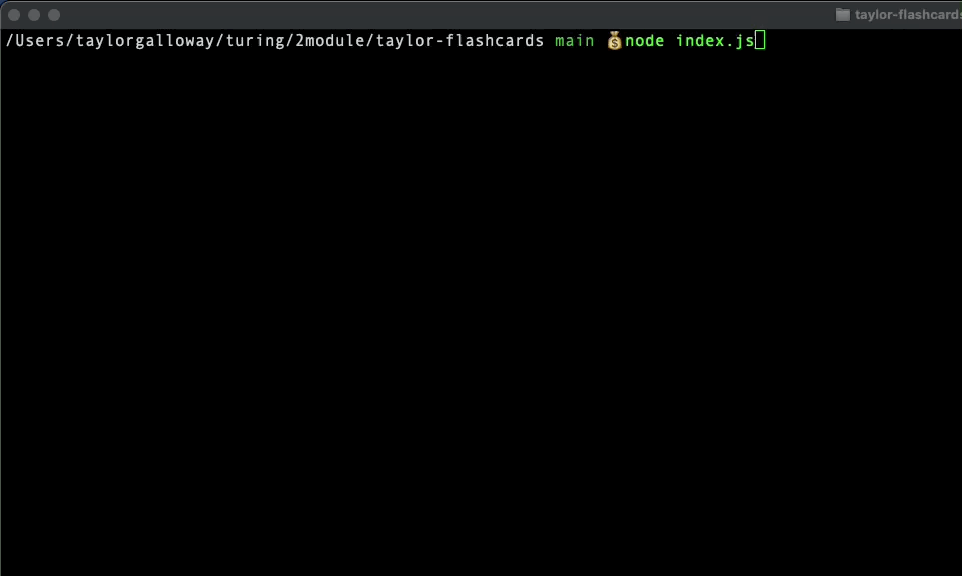

<h1 align="center">Flash Cards</h1>

Turing 2103 FE Mod 2 First Solo Project
## Table of Contents
* [Introduction](#introduction)
* [Features](#Features)
* [Technologies](#Technologies)
* [Setup](#Setup/execution-Instructions)
* [Contributors](#Contributors)

## Introduction
This is a basic flashcards application which can be played in the command line interface. Users will be prompted with various questions about JavaScript. They can select between multiple choices and will receive feedback about whether their answer was correct or incorrect. The percentage of questions they answered correctly will be displayed at the end once they have answered all questions. The total time it took for the user to go through all of the flashcards will also be displayed at the end.

## Demonstration of Application
Flashcards can be played in the terminal and will give feedback on if user answers are correct or incorrect

After all flashcards have been shown, a message will display showing the percentage of correct answers and the total time it took to complete the round.

### Technologies
- JavaScript
- Mocha
- Chai

## Setup/execution-instructions
1) Clone copy of repo to your machine
2) Using node from your command line run node index.js
3) Select between available answers using arrows or type the number of the answer you wish to select.
4) Press enter and see whether your result was correct or not

## Contributors
[Taylor Galloway](https://github.com/tylrs)
